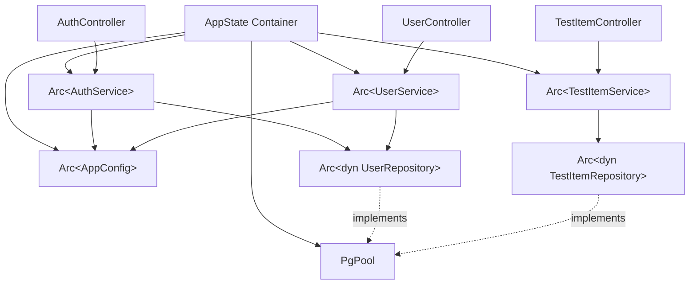

## What is Dependency Injection?

Dependency Injection (DI) is a design pattern where objects receive their dependencies from external sources rather than creating them internally. In Ironclad, we use **constructor injection** with `Arc<T>` for thread-safe shared ownership.

## Benefits of Dependency Injection

<CardGroup cols={2}>
  <Card title="Loose Coupling" icon="link-slash">
    Services depend on trait interfaces, not concrete implementations.
  </Card>
  <Card title="Testability" icon="flask">
    Easily swap real implementations with mocks for testing.
  </Card>
  <Card title="Flexibility" icon="wand-magic-sparkles">
    Change implementations (e.g., PostgreSQL to MongoDB) without modifying business logic.
  </Card>
  <Card title="Single Responsibility" icon="circle-check">
    Each component focuses on its core responsibility, not on creating dependencies.
  </Card>
</CardGroup>

## The AppState Container

Ironclad uses a centralized `AppState` struct to manage all services and their dependencies. This container is initialized once at application startup and shared across all request handlers.

**Location:** `src/bootstrap/app_state.rs`

```rust src/bootstrap/app_state.rs
use std::sync::Arc;
use sqlx::PgPool;
use actix_web::web;

use crate::config::AppConfig;
use crate::infrastructure::{PostgresUserRepository, PostgresTestItemRepository};
use crate::application::{AuthService, UserService, TestItemService};
use crate::interfaces::{UserRepository, TestItemRepository};

/// Global application state containing all services and dependencies
#[derive(Clone)]
pub struct AppState {
    pub config: Arc<AppConfig>,
    pub pool: PgPool,
    pub auth_service: Arc<AuthService>,
    pub user_service: Arc<UserService>,
    pub test_item_service: Arc<TestItemService>,
}

impl AppState {
    /// Initialize all services and dependencies
    pub fn new(config: AppConfig, pg_pool: PgPool) -> Self {
        let config = Arc::new(config);
        
        // ============================================
        // Repositories (Infrastructure Layer)
        // ============================================
        let user_repository: Arc<dyn UserRepository> =
            Arc::new(PostgresUserRepository::new(pg_pool.clone()));
        
        let test_item_repository: Arc<dyn TestItemRepository> =
            Arc::new(PostgresTestItemRepository::new(pg_pool.clone()));

        // ============================================
        // Services (Application Layer)
        // ============================================
        let auth_service = Arc::new(AuthService::new(
            user_repository.clone(),
            config.clone(),
        ));

        let user_service = Arc::new(UserService::new(
            user_repository.clone(),
            config.clone(),
        ));

        let test_item_service = Arc::new(TestItemService::new(
            test_item_repository.clone(),
        ));

        // ============================================
        // Return AppState
        // ============================================
        Self {
            config,
            pool: pg_pool,
            auth_service,
            user_service,
            test_item_service,
        }
    }
}
```

<Info>
  Notice how repositories are wrapped in `Arc<dyn Trait>`. This allows multiple services to share the same repository instance through trait objects.
</Info>

## Dependency Graph

Here's how dependencies flow in a typical Ironclad application:



## How Services Receive Dependencies

Services declare their dependencies in their constructor and store them as fields.

### Example: AuthService

```rust src/application/services/auth_service.rs
use std::sync::Arc;
use crate::config::AppConfig;
use crate::interfaces::UserRepository;

pub struct AuthService {
    user_repository: Arc<dyn UserRepository>,
    config: Arc<AppConfig>,
}

impl AuthService {
    // Constructor injection: Dependencies are passed in
    pub fn new(
        user_repository: Arc<dyn UserRepository>,
        config: Arc<AppConfig>,
    ) -> Self {
        Self {
            user_repository,
            config,
        }
    }

    // Service methods can use injected dependencies
    pub async fn register(&self, request: RegisterUserRequest) -> Result<AuthResponse, ApiError> {
        // Use self.user_repository to access database
        if self.user_repository.exists_by_email(&request.email).await? {
            return Err(ApiError::Conflict("User already exists".to_string()));
        }
        
        // Use self.config for JWT settings, etc.
        let token = create_token(&user.id, user.email.as_str(), &user.role.to_string(), &self.config)?;
        
        // ...
    }
}
```

<Tip>
  By accepting `Arc<dyn Trait>`, services depend on **interfaces**, not concrete implementations. This is the **Dependency Inversion Principle**.
</Tip>

## How Controllers Access Services

Controllers receive services as **extractors** from Actix-web's `web::Data`.

### Example: AuthController

```rust src/infrastructure/http/controllers/auth_controller.rs
use actix_web::{web, HttpResponse};
use std::sync::Arc;
use crate::application::services::AuthService;
use crate::application::dtos::{LoginRequest, RegisterUserRequest};
use crate::errors::ApiResult;
use crate::shared::ValidatedJson;

pub struct AuthController;

impl AuthController {
    pub async fn register(
        // Extract AuthService from AppState
        service: web::Data<Arc<AuthService>>,
        req: ValidatedJson<RegisterUserRequest>,
    ) -> ApiResult<HttpResponse> {
        // Call service method
        let response = service.register(req.0).await?;
        Ok(HttpResponse::Created().json(response))
    }

    pub async fn login(
        service: web::Data<Arc<AuthService>>,
        req: ValidatedJson<LoginRequest>,
    ) -> ApiResult<HttpResponse> {
        let response = service.login(req.0).await?;
        Ok(HttpResponse::Ok().json(response))
    }
}
```

### How Extraction Works

1. **Application startup** creates `AppState` with all services
2. **Actix-web** wraps `AppState` in `web::Data` for shared access
3. **Each request** extracts needed services using `web::Data<Arc<ServiceName>>`
4. **Controllers** call service methods

```rust src/main.rs
use actix_web::{web, App, HttpServer};
use crate::bootstrap::AppState;

#[actix_web::main]
async fn main() -> std::io::Result<()> {
    // 1. Create AppState with all dependencies
    let app_state = AppState::new(config, pool);
    
    // 2. Wrap in web::Data for shared access
    let auth_service = web::Data::new(app_state.auth_service.clone());
    let user_service = web::Data::new(app_state.user_service.clone());
    
    // 3. Start HTTP server
    HttpServer::new(move || {
        App::new()
            // Register services for extraction
            .app_data(auth_service.clone())
            .app_data(user_service.clone())
            // Configure routes
            .configure(routes::configure)
    })
    .bind(("127.0.0.1", 8080))?
    .run()
    .await
}
```

<Info>
  `web::Data` is Actix-web's extractor for application state. It provides thread-safe shared access to services across all request handlers.
</Info>

## Repository Injection

Repositories implement trait interfaces and are injected into services.

### 1. Define the Interface (Interfaces Layer)

```rust src/interfaces/repositories/user_repository.rs
use async_trait::async_trait;
use crate::domain::entities::User;
use crate::errors::ApiError;

#[async_trait]
pub trait UserRepository: Send + Sync {
    async fn create(&self, user: &User) -> Result<User, ApiError>;
    async fn get_by_email(&self, email: &str) -> Result<Option<User>, ApiError>;
    async fn exists_by_email(&self, email: &str) -> Result<bool, ApiError>;
}
```

### 2. Implement the Interface (Infrastructure Layer)

```rust src/infrastructure/persistence/postgres/user_repository.rs
use sqlx::PgPool;
use async_trait::async_trait;
use crate::interfaces::repositories::UserRepository;
use crate::domain::entities::User;
use crate::errors::ApiError;

pub struct PostgresUserRepository {
    pool: PgPool,
}

impl PostgresUserRepository {
    pub fn new(pool: PgPool) -> Self {
        Self { pool }
    }
}

#[async_trait]
impl UserRepository for PostgresUserRepository {
    async fn create(&self, user: &User) -> Result<User, ApiError> {
        // SQL implementation...
    }
}
```

### 3. Inject into Service (Application Layer)

```rust
let user_repository: Arc<dyn UserRepository> = 
    Arc::new(PostgresUserRepository::new(pg_pool.clone()));

let auth_service = Arc::new(AuthService::new(
    user_repository.clone(),
    config.clone(),
));
```

<Note>
  The service receives `Arc<dyn UserRepository>`, not `Arc<PostgresUserRepository>`. This means you can swap implementations without changing service code.
</Note>

## Testing with Mock Repositories

Dependency injection makes testing trivial. Create mock implementations for unit tests:

```rust tests/auth_service_test.rs
use async_trait::async_trait;
use std::sync::Arc;
use crate::interfaces::UserRepository;
use crate::domain::entities::User;
use crate::errors::ApiError;

// Mock repository for testing
struct MockUserRepository {
    should_exist: bool,
}

#[async_trait]
impl UserRepository for MockUserRepository {
    async fn create(&self, user: &User) -> Result<User, ApiError> {
        Ok(user.clone())
    }

    async fn get_by_email(&self, _email: &str) -> Result<Option<User>, ApiError> {
        Ok(None)  // Simulate "not found"
    }

    async fn exists_by_email(&self, _email: &str) -> Result<bool, ApiError> {
        Ok(self.should_exist)  // Control return value
    }
}

#[tokio::test]
async fn test_register_duplicate_email() {
    // Inject mock repository
    let mock_repo = Arc::new(MockUserRepository { should_exist: true });
    let config = Arc::new(AppConfig::default());
    let service = AuthService::new(mock_repo, config);
    
    // Test should fail due to duplicate email
    let request = RegisterUserRequest {
        email: "test@example.com".to_string(),
        username: "testuser".to_string(),
        password: "password123".to_string(),
    };
    
    let result = service.register(request).await;
    assert!(result.is_err());
}
```

<Tip>
  No database needed for unit tests! Mock repositories return controlled data, making tests fast and reliable.
</Tip>

## Adding a New Service

Here's how to add a new service to the DI container:

### Step 1: Create the Repository Interface

```rust src/interfaces/repositories/product_repository.rs
use async_trait::async_trait;
use crate::domain::entities::Product;
use crate::errors::ApiError;

#[async_trait]
pub trait ProductRepository: Send + Sync {
    async fn create(&self, product: &Product) -> Result<Product, ApiError>;
    async fn get_by_id(&self, id: &str) -> Result<Option<Product>, ApiError>;
}
```

### Step 2: Implement the Repository

```rust src/infrastructure/persistence/postgres/product_repository.rs
use sqlx::PgPool;
use async_trait::async_trait;
use crate::interfaces::repositories::ProductRepository;

pub struct PostgresProductRepository {
    pool: PgPool,
}

impl PostgresProductRepository {
    pub fn new(pool: PgPool) -> Self {
        Self { pool }
    }
}

#[async_trait]
impl ProductRepository for PostgresProductRepository {
    // Implementation...
}
```

### Step 3: Create the Service

```rust src/application/services/product_service.rs
use std::sync::Arc;
use crate::interfaces::repositories::ProductRepository;

pub struct ProductService {
    product_repository: Arc<dyn ProductRepository>,
}

impl ProductService {
    pub fn new(product_repository: Arc<dyn ProductRepository>) -> Self {
        Self { product_repository }
    }
}
```

### Step 4: Add to AppState

```rust src/bootstrap/app_state.rs
#[derive(Clone)]
pub struct AppState {
    // ... existing fields ...
    pub product_service: Arc<ProductService>,  // Add here
}

impl AppState {
    pub fn new(config: AppConfig, pg_pool: PgPool) -> Self {
        // ... existing code ...
        
        // Create repository
        let product_repository: Arc<dyn ProductRepository> =
            Arc::new(PostgresProductRepository::new(pg_pool.clone()));
        
        // Create service
        let product_service = Arc::new(ProductService::new(
            product_repository.clone(),
        ));
        
        Self {
            // ... existing fields ...
            product_service,  // Add to constructor
        }
    }
}
```

### Step 5: Register in main.rs

```rust src/main.rs
let product_service = web::Data::new(app_state.product_service.clone());

App::new()
    .app_data(product_service.clone())  // Register for extraction
    .configure(routes::configure)
```

### Step 6: Use in Controller

```rust src/infrastructure/http/controllers/product_controller.rs
use actix_web::{web, HttpResponse};
use std::sync::Arc;
use crate::application::services::ProductService;

pub struct ProductController;

impl ProductController {
    pub async fn create(
        service: web::Data<Arc<ProductService>>,  // Extract service
        // ...
    ) -> ApiResult<HttpResponse> {
        // Use service...
    }
}
```

## Alternative: Service Provider Pattern

Ironclad also includes a **Service Provider** pattern (similar to Laravel) for more modular registration:

```rust src/bootstrap/providers.rs
use crate::bootstrap::ServiceContainer;

pub trait ServiceProvider: Send + Sync {
    fn name(&self) -> &str;
    fn register(&self, container: &mut ServiceContainer);
    fn boot(&self, _container: &ServiceContainer) {}
}

pub struct ProviderRegistry {
    providers: Vec<Box<dyn ServiceProvider>>,
}

impl ProviderRegistry {
    pub fn new() -> Self {
        Self { providers: Vec::new() }
    }
    
    pub fn register<P: ServiceProvider + 'static>(&mut self, provider: P) {
        self.providers.push(Box::new(provider));
    }
    
    pub fn boot_all(&self, container: &mut ServiceContainer) {
        // Phase 1: Register all services
        for provider in &self.providers {
            provider.register(container);
        }
        
        // Phase 2: Boot all services
        for provider in &self.providers {
            provider.boot(container);
        }
    }
}
```

<Info>
  The Provider pattern is useful for larger applications where you want to organize service registration into separate modules.
</Info>

## Key Takeaways

<AccordionGroup>
  <Accordion title="Constructor Injection">
    Services receive dependencies through constructors, not by creating them internally.
  </Accordion>
  <Accordion title="Arc for Sharing">
    Use `Arc<T>` to share dependencies across multiple services and threads safely.
  </Accordion>
  <Accordion title="Depend on Traits">
    Services depend on `Arc<dyn Trait>`, not concrete types, enabling flexibility and testing.
  </Accordion>
  <Accordion title="Centralized Container">
    `AppState` acts as a centralized DI container, initialized once at startup.
  </Accordion>
  <Accordion title="Actix Extraction">
    Controllers extract services using `web::Data<Arc<Service>>` from the request context.
  </Accordion>
</AccordionGroup>

## Next Steps

<CardGroup cols={2}>
  <Card title="Architecture Overview" icon="sitemap" href="/architecture/overview">
    Understand the big picture
  </Card>
  <Card title="Layer Details" icon="layer-group" href="/architecture/layers">
    Deep dive into each layer
  </Card>
  <Card title="Quick Start" icon="rocket" href="/quickstart">
    Build your first endpoint
  </Card>
  <Card title="Testing Guide" icon="flask" href="/essentials/testing">
    Learn how to test with DI
  </Card>
</CardGroup>