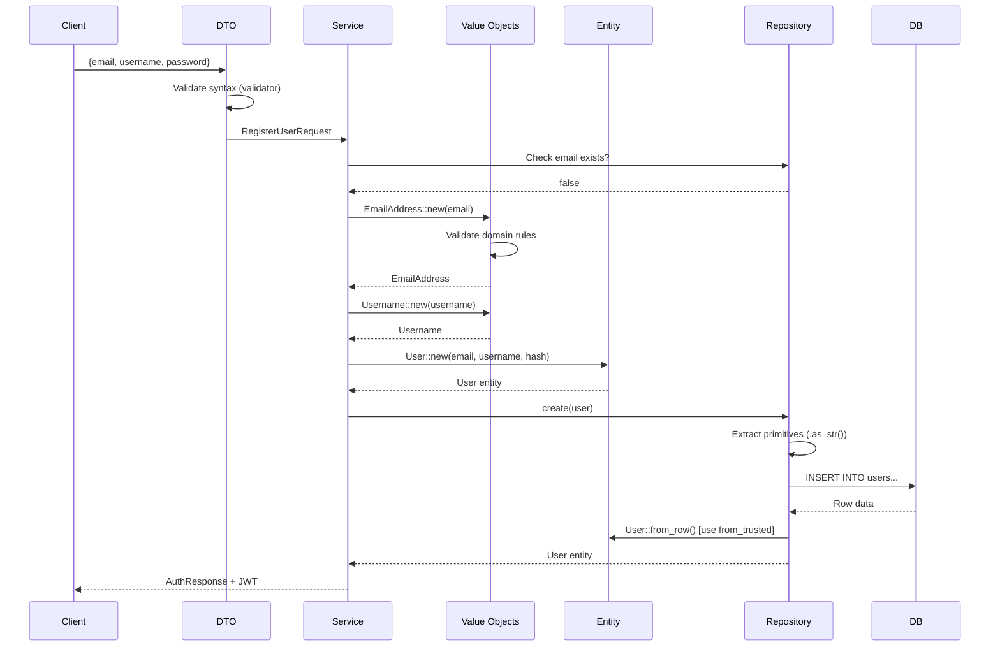

## What is Domain-Driven Design?

Domain-Driven Design (DDD) is a software development approach that focuses on modeling your code around the business domain. In Ironclad, we implement DDD principles to ensure your application logic remains clean, testable, and maintainable.

## Core DDD Concepts in Ironclad

### Entities

Entities are objects with a unique identity that persists over time. In Ironclad, entities represent core business concepts.

**Example:** The User entity from `src/domain/entities/user.rs`

```rust src/domain/entities/user.rs
use chrono::{DateTime, Utc};
use serde::{Deserialize, Serialize};
use uuid::Uuid;
use crate::domain::value_objects::{Role, Username, EmailAddress};
use crate::errors::DomainError;

#[derive(Debug, Clone, Serialize, Deserialize)]
pub struct User {
    pub id: String,
    pub email: EmailAddress,
    pub username: Username,
    pub password_hash: String,
    pub role: Role,
    pub is_active: bool,
    pub created_at: DateTime<Utc>,
    pub updated_at: DateTime<Utc>,
}

impl User {
    /// Smart Constructor: Returns Result guaranteeing a valid state
    pub fn new(
        email: EmailAddress, 
        username: Username, 
        password_hash: String
    ) -> Result<Self, DomainError> {
        let now = Utc::now();
        Ok(Self {
            id: Uuid::new_v4().to_string(),
            email,
            username,
            password_hash,
            role: Role::default(),
            is_active: true,
            created_at: now,
            updated_at: now,
        })
    }

    // Business logic methods
    pub fn is_admin(&self) -> bool {
        self.role.is_admin()
    }

    pub fn activate(&mut self) {
        self.is_active = true;
        self.updated_at = Utc::now();
    }
}
```

<Tip>
  Notice how entities use **Value Objects** (`EmailAddress`, `Username`) instead of primitive types. This prevents invalid state and encapsulates validation logic.
</Tip>

### Value Objects

Value Objects are immutable objects that represent a domain concept. They have no identity and are defined by their attributes. In Ironclad, Value Objects use **Smart Constructors** to ensure they're always valid.

#### Example: EmailAddress Value Object

```rust src/domain/value_objects/email_address.rs
use serde::{Deserialize, Serialize};
use crate::errors::DomainError;

#[derive(Debug, Clone, Serialize, Deserialize)]
pub struct EmailAddress(String);

impl EmailAddress {
    /// Smart Constructor: Executes immutable business rules
    pub fn new(value: String) -> Result<Self, DomainError> {
        if value.trim().is_empty() || !value.contains('@') {
            return Err(DomainError::Validation(
                "Invalid email format at domain level".into()
            ));
        }
        Ok(Self(value))
    }

    /// Hydration: Used EXCLUSIVELY by persistence layer (Database)
    /// Assumes data is already valid.
    pub fn from_trusted(value: String) -> Self {
        Self(value)
    }

    /// Extract primitive value for DTOs or Database
    pub fn as_str(&self) -> &str {
        &self.0
    }
}
```

#### Example: Role Value Object (Enum)

```rust src/domain/value_objects/role.rs
use serde::{Deserialize, Serialize};
use std::fmt;

#[derive(Debug, Clone, Serialize, Deserialize, PartialEq, Eq)]
pub enum Role {
    Admin,
    User,
    Moderator,
    Premium,
}

impl Role {
    pub fn as_str(&self) -> &str {
        match self {
            Role::Admin => "admin",
            Role::User => "user",
            Role::Moderator => "moderator",
            Role::Premium => "premium",
        }
    }

    pub fn from_str(s: &str) -> Option<Self> {
        match s.to_lowercase().as_str() {
            "admin" => Some(Role::Admin),
            "user" => Some(Role::User),
            "moderator" => Some(Role::Moderator),
            "premium" => Some(Role::Premium),
            _ => None,
        }
    }

    pub fn is_admin(&self) -> bool {
        matches!(self, Role::Admin)
    }

    pub fn can_moderate(&self) -> bool {
        matches!(self, Role::Admin | Role::Moderator)
    }
}

impl Default for Role {
    fn default() -> Self {
        Role::User
    }
}
```

<Note>
  Value Objects enforce **business rules at compile time**. You can't create an invalid `EmailAddress` or `Role` - the type system prevents it.
</Note>

## The Three-Layer Validation Strategy

Ironclad implements a clear separation of validation responsibilities:

### Layer 1: HTTP Layer (DTOs) - Syntactic Validation

**Purpose:** Fast-fail validation of HTTP request structure

**Location:** `src/application/dtos/`

```rust src/application/dtos/auth_dto.rs
use serde::Deserialize;
use validator::Validate;

#[derive(Debug, Deserialize, Validate)]
pub struct RegisterUserRequest {
    #[validate(email(message = "Invalid email format"))]
    pub email: String,
    
    #[validate(length(min = 3, max = 50, message = "Username must be 3-50 characters"))]
    pub username: String,
    
    #[validate(length(min = 8, message = "Password must be at least 8 characters"))]
    pub password: String,
}
```

### Layer 2: Application Layer (Services) - Business Rules with I/O

**Purpose:** Validate rules that require database access or external services

**Location:** `src/application/services/`

```rust src/application/services/auth_service.rs
pub async fn register(&self, request: RegisterUserRequest) -> Result<AuthResponse, ApiError> {
    // 1. I/O-dependent validation: Check uniqueness
    if self.user_repository.exists_by_email(&request.email).await? {
        return Err(ApiError::Conflict("User already exists".to_string()));
    }
    
    // 2. Create Value Objects (domain validation happens here)
    let email_vo = EmailAddress::new(request.email)?;
    let username_vo = Username::new(request.username)?;
    
    // 3. Hash password before creating entity
    let password_hash = hash_password(&request.password, &self.config)?;
    
    // 4. Create entity
    let user = User::new(email_vo, username_vo, password_hash)?;
    
    // 5. Persist
    let created_user = self.user_repository.create(&user).await?;
    
    Ok(/* ... */)
}
```

### Layer 3: Domain Layer (Value Objects) - Immutable Business Rules

**Purpose:** Enforce core business invariants that never change

**Location:** `src/domain/value_objects/`

This is where Value Objects validate themselves (shown in examples above).

## Repository Pattern

The Repository Pattern abstracts data access behind trait interfaces, allowing you to swap implementations without changing business logic.

### Interface Definition

```rust src/interfaces/repositories/user_repository.rs
use crate::domain::entities::User;
use crate::errors::ApiError;
use async_trait::async_trait;

/// User Repository - Data access contract
#[async_trait]
pub trait UserRepository: Send + Sync {
    async fn create(&self, user: &User) -> Result<User, ApiError>;
    async fn get_by_id(&self, id: &str) -> Result<Option<User>, ApiError>;
    async fn get_by_email(&self, email: &str) -> Result<Option<User>, ApiError>;
    async fn get_all(&self) -> Result<Vec<User>, ApiError>;
}
```

### PostgreSQL Implementation

```rust src/infrastructure/persistence/postgres/user_repository.rs
use sqlx::PgPool;
use async_trait::async_trait;
use crate::domain::entities::User;
use crate::errors::ApiError;
use crate::interfaces::repositories::UserRepository;

pub struct PostgresUserRepository {
    pool: PgPool,
}

impl PostgresUserRepository {
    pub fn new(pool: PgPool) -> Self {
        Self { pool }
    }
}

#[async_trait]
impl UserRepository for PostgresUserRepository {
    async fn create(&self, user: &User) -> Result<User, ApiError> {
        let query = r#"
            INSERT INTO users (id, email, username, password_hash, role, is_active, created_at, updated_at)
            VALUES ($1, $2, $3, $4, $5, $6, $7, $8)
            RETURNING *
        "#;
        
        let created_user = sqlx::query_as::<_, User>(query)
            .bind(&user.id)
            .bind(user.email.as_str())  // Extract primitive from Value Object
            .bind(user.username.as_str())
            .bind(&user.password_hash)
            .bind(user.role.as_str())
            .bind(user.is_active)
            .bind(user.created_at)
            .bind(user.updated_at)
            .fetch_one(&self.pool)
            .await
            .map_err(|e| ApiError::DatabaseError(e.to_string()))?;

        Ok(created_user)
    }
}
```

<Tip>
  Notice how the repository extracts primitive values from Value Objects using `.as_str()` when writing to the database, and uses `.from_trusted()` when reading.
</Tip>

## Database Hydration

When loading entities from the database, you trust the data is already valid, so you use the `from_trusted()` method:

```rust src/domain/entities/user.rs
impl sqlx::FromRow<'_, PgRow> for User {
    fn from_row(row: &PgRow) -> Result<Self, sqlx::Error> {
        Ok(User {
            id: row.try_get("id")?,
            // Use from_trusted because we trust database integrity
            email: EmailAddress::from_trusted(row.try_get("email")?),
            username: Username::from_trusted(row.try_get("username")?),
            password_hash: row.try_get("password_hash")?,
            role: Role::from_str(&row.try_get::<String, _>("role")?)
                .ok_or_else(|| sqlx::Error::Decode("Invalid role".into()))?,
            is_active: row.try_get("is_active")?,
            created_at: row.try_get("created_at")?,
            updated_at: row.try_get("updated_at")?,
        })
    }
}
```

## Complete Data Flow

Here's how data flows through a DDD architecture when creating a new user:



## Benefits of This Approach

<CardGroup cols={2}>
  <Card title="No Invalid State" icon="shield-check">
    Value Objects with Smart Constructors make it impossible to create invalid domain objects.
  </Card>
  <Card title="Clear Responsibilities" icon="list-check">
    Each layer has distinct validation responsibilities: syntax, I/O rules, and domain invariants.
  </Card>
  <Card title="Type Safety" icon="code">
    Using `EmailAddress` instead of `String` prevents bugs at compile time.
  </Card>
  <Card title="Testable" icon="flask">
    Repository traits allow easy mocking for unit tests without database access.
  </Card>
</CardGroup>

## Next Steps

<CardGroup cols={2}>
  <Card title="Layer Details" icon="layer-group" href="/architecture/layers">
    Deep dive into each architectural layer
  </Card>
  <Card title="Dependency Injection" icon="plug" href="/architecture/dependency-injection">
    Learn how services are wired together
  </Card>
</CardGroup>