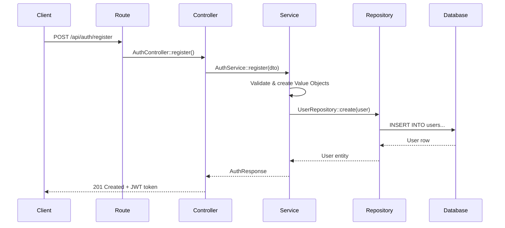

## Introduction

Rust Ironclad is an enterprise-grade backend framework built with Rust that follows **Domain-Driven Design (DDD)** principles with a clean 5-layer architecture. This design ensures maximum maintainability, testability, and scalability for your applications.

## Architecture Diagram

```
┌─────────────────────────────────────┐
│  Routes Layer                       │ ← HTTP Routing
├─────────────────────────────────────┤
│  Infrastructure Layer               │ ← HTTP, Extractors, Controllers
├─────────────────────────────────────┤
│  Application Layer                  │ ← Services, DTOs, Use Cases
├─────────────────────────────────────┤
│  Domain Layer                       │ ← Entities, Value Objects, Business Logic
├─────────────────────────────────────┤
│  Interfaces Layer                   │ ← Trait Definitions (Repository Pattern)
└─────────────────────────────────────┘
```

## Core Design Principles

<CardGroup cols={2}>
  <Card title="Clean Architecture" icon="layer-group">
    Each layer has a specific responsibility and depends only on layers below it. The Domain layer has no external dependencies.
  </Card>
  <Card title="Repository Pattern" icon="database">
    Data access is abstracted through trait interfaces, making it easy to swap implementations or mock for testing.
  </Card>
  <Card title="Value Objects" icon="shield-check">
    Domain concepts are encapsulated in type-safe Value Objects with built-in validation, preventing invalid state.
  </Card>
  <Card title="Dependency Injection" icon="plug">
    Services are injected through constructor parameters, enabling loose coupling and easy testing.
  </Card>
</CardGroup>

## The Five Layers

### 1. Routes Layer

Defines HTTP routing configuration and maps URLs to controllers.

**Location:** `src/routes/`

```rust src/routes/api.rs
use actix_web::web;
use crate::infrastructure::http::{AuthController, UserController};

pub fn configure(cfg: &mut web::ServiceConfig) {
    cfg.service(
        web::scope("/api")
            .service(
                web::scope("/auth")
                    .route("/register", web::post().to(AuthController::register))
                    .route("/login", web::post().to(AuthController::login))
            )
            .service(
                web::scope("/user")
                    .route("/profile", web::get().to(UserController::get_profile))
                    .route("/all", web::get().to(UserController::get_all_users))
            )
    );
}
```

### 2. Infrastructure Layer

Handles external concerns like HTTP requests, database access, and third-party integrations.

**Location:** `src/infrastructure/`

**Contains:**
- **Controllers:** Handle HTTP requests and responses
- **Persistence:** Database repository implementations
- **HTTP utilities:** Authentication extractors, middleware

### 3. Application Layer

Orchestrates business logic through services and defines data transfer objects (DTOs).

**Location:** `src/application/`

**Contains:**
- **Services:** Coordinate use cases and business workflows
- **DTOs:** Request/response structures with validation

### 4. Domain Layer

The heart of your application containing pure business logic.

**Location:** `src/domain/`

**Contains:**
- **Entities:** Core business objects (User, Product, etc.)
- **Value Objects:** Immutable, self-validating domain concepts
- **Business Rules:** Pure domain logic with no external dependencies

### 5. Interfaces Layer

Defines contracts (traits) for data access and external services.

**Location:** `src/interfaces/`

**Contains:**
- **Repository traits:** Define data access contracts
- **Service interfaces:** Abstract external dependencies

## Key Design Patterns

### Repository Pattern

Abstracts data access behind trait interfaces:

```rust src/interfaces/repositories/user_repository.rs
use async_trait::async_trait;
use crate::domain::entities::User;
use crate::errors::ApiError;

#[async_trait]
pub trait UserRepository: Send + Sync {
    async fn create(&self, user: &User) -> Result<User, ApiError>;
    async fn get_by_id(&self, id: &str) -> Result<Option<User>, ApiError>;
    async fn get_by_email(&self, email: &str) -> Result<Option<User>, ApiError>;
}
```

### Smart Constructors

Value Objects validate their state upon creation:

```rust
pub struct EmailAddress(String);

impl EmailAddress {
    pub fn new(value: String) -> Result<Self, DomainError> {
        if value.trim().is_empty() || !value.contains('@') {
            return Err(DomainError::Validation("Invalid email format".into()));
        }
        Ok(Self(value))
    }
}
```

## Data Flow Example

Here's how a user registration request flows through the architecture:



## Benefits of This Architecture

<AccordionGroup>
  <Accordion title="Testability">
    Each layer can be tested independently. Mock repositories and services for fast unit tests.
  </Accordion>
  <Accordion title="Maintainability">
    Clear separation of concerns makes code easy to understand and modify. Changes in one layer rarely affect others.
  </Accordion>
  <Accordion title="Scalability">
    Swap implementations (e.g., PostgreSQL to MongoDB) by changing only the Infrastructure layer.
  </Accordion>
  <Accordion title="Type Safety">
    Value Objects and strong typing prevent invalid state at compile time, not runtime.
  </Accordion>
</AccordionGroup>

## Next Steps

<CardGroup cols={2}>
  <Card title="DDD Principles" icon="brain" href="/architecture/domain-driven-design">
    Deep dive into Domain-Driven Design concepts
  </Card>
  <Card title="Layer Details" icon="layer-group" href="/architecture/layers">
    Detailed explanation of each layer
  </Card>
  <Card title="Dependency Injection" icon="plug" href="/architecture/dependency-injection">
    How DI works in Ironclad
  </Card>
  <Card title="Quick Start" icon="rocket" href="/quickstart">
    Build your first endpoint
  </Card>
</CardGroup>

## Performance Features

<Info>
  Ironclad uses **Actix-web**, one of the fastest web frameworks available, capable of handling **50,000+ requests/second** with non-blocking async I/O powered by Tokio.
</Info>

## Repository Structure

```
src/
├── routes/              # Layer 1: HTTP routing
├── infrastructure/      # Layer 2: External concerns
│   ├── http/           # Controllers, authentication
│   └── persistence/    # Database implementations
├── application/         # Layer 3: Services & DTOs
│   ├── services/
│   └── dtos/
├── domain/              # Layer 4: Business logic
│   ├── entities/
│   └── value_objects/
└── interfaces/          # Layer 5: Trait definitions
    └── repositories/
```