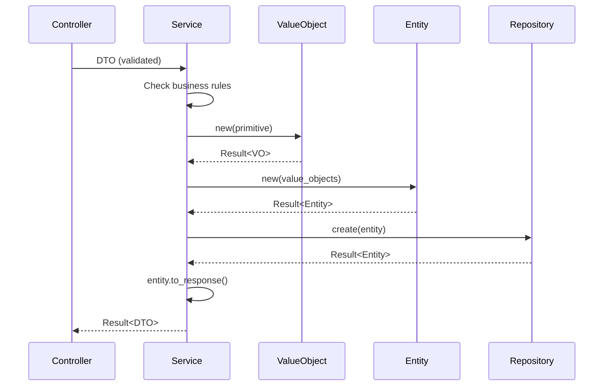

Services contain your application's business logic. They orchestrate operations between controllers, repositories, and domain entities, enforcing business rules and managing workflows.

## Service Architecture

Services sit in the Application Layer and coordinate:

1. **DTO validation** - Transform and validate request data
2. **Business rules** - Enforce domain-specific logic
3. **Value Object creation** - Convert primitives to domain types
4. **Entity operations** - Create, update, and manage entities
5. **Repository access** - Persist and retrieve data
6. **External integrations** - Call third-party services

<Note>
Services handle **contextual** business rules that require I/O or external state. Immutable domain rules belong in [Value Objects](/core-concepts/entities-value-objects).
</Note>

## Basic Service Structure

```rust src/application/services/test_item_service.rs
use std::sync::Arc;
use crate::application::dtos::{
    CreateTestItemRequest,
    UpdateTestItemRequest,
    TestItemResponse,
    PaginatedTestItemsResponse,
};
use crate::domain::entities::TestItem;
use crate::errors::ApiError;
use crate::interfaces::TestItemRepository;

pub struct TestItemService {
    repository: Arc<dyn TestItemRepository>,
}

impl TestItemService {
    pub fn new(repository: Arc<dyn TestItemRepository>) -> Self {
        Self { repository }
    }

    pub async fn create(&self, request: CreateTestItemRequest) -> Result<TestItemResponse, ApiError> {
        let item = TestItem::new(request.subject, request.optional_field);
        let created_item = self.repository.create(&item).await?;
        Ok(created_item.to_response())
    }

    pub async fn get_by_id(&self, id: &str) -> Result<Option<TestItemResponse>, ApiError> {
        let item = self.repository.get_by_id(id).await?;
        Ok(item.map(|i| i.to_response()))
    }
}
```

## Service with Business Rules

The `AuthService` demonstrates complex business logic:

```rust src/application/services/auth_service.rs
use std::sync::Arc;
use crate::application::dtos::{AuthResponse, LoginRequest, RegisterUserRequest};
use crate::config::AppConfig;
use crate::domain::entities::User;
use crate::domain::value_objects::{EmailAddress, Username};
use crate::errors::ApiError;
use crate::interfaces::UserRepository;
use crate::utils::auth::hash_password;
use crate::utils::jwt::create_token;
use crate::shared::validator::validate_strong_password;

pub struct AuthService {
    user_repository: Arc<dyn UserRepository>,
    config: Arc<AppConfig>,
}

impl AuthService {
    pub fn new(user_repository: Arc<dyn UserRepository>, config: Arc<AppConfig>) -> Self {
        Self {
            user_repository,
            config,
        }
    }

    pub async fn register(&self, request: RegisterUserRequest) -> Result<AuthResponse, ApiError> {
        // 1. Validate password strength (Application Layer rule)
        if validate_strong_password(&request.password).is_err() {
            return Err(ApiError::ValidationError(
                "Password does not meet security requirements".to_string()
            ));
        }

        // 2. Check uniqueness (requires I/O)
        if self.user_repository.exists_by_email(&request.email).await? {
            return Err(ApiError::Conflict("User already exists".to_string()));
        }
        
        // 3. Create Value Objects (enforces domain rules)
        let email_vo = EmailAddress::new(request.email)?;
        let username_vo = Username::new(request.username)?;
        
        let password_hash = hash_password(&request.password, &self.config)?;
        
        // 4. Create entity with validated Value Objects
        let user = User::new(email_vo, username_vo, password_hash)?;
        
        // 5. Persist
        let created_user = self.user_repository.create(&user).await?;
        
        // 6. Generate JWT token
        let token = create_token(
            &created_user.id,
            created_user.email.as_str(),
            &created_user.role.to_string(),
            &self.config,
        )?;
        
        Ok(AuthResponse {
            user: created_user.to_response(),
            token,
        })
    }
}
```

## Three-Layer Validation

Ironclad follows Domain-Driven Design principles with strict separation:

<Steps>

### HTTP Layer (DTOs)

Pure syntactic validation:
- "String must not be empty"
- "Maximum length of 50 characters"
- "Must be valid email format"

```rust
#[derive(Validate)]
pub struct RegisterUserRequest {
    #[validate(email(message = "Invalid email format"))]
    pub email: String,
}
```

### Application Layer (Services)

Contextual business rules requiring I/O:
- "Email already exists in database"
- "Password must meet strength requirements"
- "User cannot exceed resource quota"

```rust
if self.user_repository.exists_by_email(&request.email).await? {
    return Err(ApiError::Conflict("User already exists".to_string()));
}
```

### Domain Layer (Value Objects)

Immutable business rules and state integrity:
- "Username only accepts alphanumeric characters"
- "Email must contain @"
- Self-validate upon instantiation

```rust
impl EmailAddress {
    pub fn new(value: String) -> Result<Self, DomainError> {
        if value.trim().is_empty() || !value.contains('@') {
            return Err(DomainError::Validation("Invalid email format".into()));
        }
        Ok(Self(value))
    }
}
```

</Steps>

## CRUD Operations

### Create

```rust src/application/services/test_item_service.rs
pub async fn create(&self, request: CreateTestItemRequest) -> Result<TestItemResponse, ApiError> {
    let item = TestItem::new(request.subject, request.optional_field);
    let created_item = self.repository.create(&item).await?;
    Ok(created_item.to_response())
}
```

### Read with Pagination

```rust src/application/services/test_item_service.rs
pub async fn get_all(&self, page: i32, per_page: i32) -> Result<PaginatedTestItemsResponse, ApiError> {
    if page < 1 || per_page < 1 || per_page > 100 {
        return Err(ApiError::ValidationError("Invalid pagination parameters".to_string()));
    }

    let (items, total) = self.repository.get_paginated(page, per_page).await?;
    let item_responses: Vec<TestItemResponse> = items
        .into_iter()
        .map(|i| i.to_response())
        .collect();

    Ok(PaginatedTestItemsResponse::new(item_responses, total, page, per_page))
}
```

### Update

```rust src/application/services/test_item_service.rs
pub async fn update(&self, id: &str, request: UpdateTestItemRequest) -> Result<TestItemResponse, ApiError> {
    let mut item = self.repository.get_by_id(id).await?
        .ok_or_else(|| ApiError::NotFound("Test item not found".to_string()))?;

    if let Some(subject) = request.subject {
        item.update_subject(subject);
    }

    if request.optional_field.is_some() {
        item.update_optional_field(request.optional_field);
    }

    self.repository.update(&item).await?;
    Ok(item.to_response())
}
```

### Delete

```rust src/application/services/test_item_service.rs
pub async fn delete(&self, id: &str) -> Result<(), ApiError> {
    let deleted = self.repository.delete(id).await?;
    if !deleted {
        return Err(ApiError::NotFound("Test item not found".to_string()));
    }
    Ok(())
}
```

## Authentication Logic

```rust src/application/services/auth_service.rs
pub async fn login(&self, request: LoginRequest) -> Result<AuthResponse, ApiError> {
    let user = self
        .user_repository
        .get_by_email(&request.email)
        .await?
        .ok_or(ApiError::Unauthorized)?;

    if !user.is_active() {
        return Err(ApiError::Forbidden("Account is disabled".to_string()));
    }

    if !crate::utils::auth::verify_password(&request.password, &user.password_hash)? {
        return Err(ApiError::Unauthorized);
    }

    let token = create_token(
        &user.id,
        user.email.as_str(),
        &user.role.to_string(),
        &self.config,
    )?;

    Ok(AuthResponse {
        user: user.to_response(),
        token,
    })
}
```

## Dependency Injection

Services receive dependencies through their constructor:

```rust
pub struct AuthService {
    user_repository: Arc<dyn UserRepository>,
    config: Arc<AppConfig>,
}

impl AuthService {
    pub fn new(user_repository: Arc<dyn UserRepository>, config: Arc<AppConfig>) -> Self {
        Self {
            user_repository,
            config,
        }
    }
}
```

<Note>
Use `Arc<dyn Trait>` for repositories to enable dependency injection and testing.
</Note>

## Error Handling

Services return `Result<T, ApiError>` to propagate errors:

```rust
pub async fn get_by_id(&self, id: &str) -> Result<Option<TestItemResponse>, ApiError> {
    let item = self.repository.get_by_id(id).await?;
    Ok(item.map(|i| i.to_response()))
}
```

The `?` operator automatically converts:
- `DomainError` → `ApiError::BadRequest`
- Database errors → `ApiError::DatabaseError`
- Not found → `ApiError::NotFound`

## Service Responsibilities

<Tip>
**Services SHOULD:**
- Orchestrate business workflows
- Validate contextual rules (uniqueness, quotas)
- Transform DTOs to domain objects
- Call repositories for persistence
- Handle external integrations
- Convert entities to response DTOs

**Services SHOULD NOT:**
- Handle HTTP concerns (status codes, headers)
- Contain domain validation logic (use Value Objects)
- Directly access databases (use repositories)
- Manage transactions (repository responsibility)
</Tip>

## Data Flow Through Services



## Testing Services

Services are easy to test with mock repositories:

```rust
#[cfg(test)]
mod tests {
    use super::*;
    use mockall::predicate::*;
    use mockall::mock;

    mock! {
        TestItemRepo {}
        #[async_trait]
        impl TestItemRepository for TestItemRepo {
            async fn create(&self, item: &TestItem) -> Result<TestItem, ApiError>;
        }
    }

    #[tokio::test]
    async fn test_create_item() {
        let mut mock_repo = MockTestItemRepo::new();
        mock_repo.expect_create()
            .returning(|item| Ok(item.clone()));

        let service = TestItemService::new(Arc::new(mock_repo));
        let request = CreateTestItemRequest {
            subject: "Test".to_string(),
            optional_field: None,
        };

        let result = service.create(request).await;
        assert!(result.is_ok());
    }
}
```

## Best Practices

<Warning>
- **Never expose entities directly** - Always convert to DTOs
- **Validate before persistence** - Create Value Objects before entities
- **Check uniqueness in service** - Don't rely on database constraints alone
- **Use transactions for multi-step operations** - Ensure atomicity
</Warning>

## Next Steps

- Understand [Entities and Value Objects](/core-concepts/entities-value-objects)
- Learn about [Repositories](/core-concepts/repositories) for data access
- Explore [DTOs](/core-concepts/dtos) for request/response handling